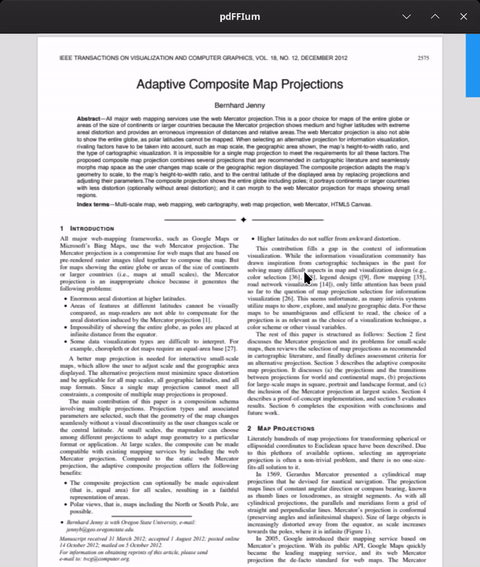

# pdFFIum

> [!WARNING]  
> **Not actively developed.** For production use, please use [pdfrx](https://github.com/espresso3389/pdfrx).

A cross-platform PDF engine and viewer built with **Dart FFI** to interface with **PDFium**. 

Originally intended to serve as the core for a custom PDF annotation suite, I have since switched to using `pdfrx`. However, this repository may still act as a demo for:
* **(Mis)using `InteractiveViewer`:** Retrofitting vertical scrolling and a custom scrollbar onto the widget via a lazy-loading system based on viewport `Quad` intersections.
* **Dart FFI:** Interfacing with native C++ libraries and managing manual memory/pointer disposal.

---

### 

---

## License

This project is open-source and available under the MIT License.